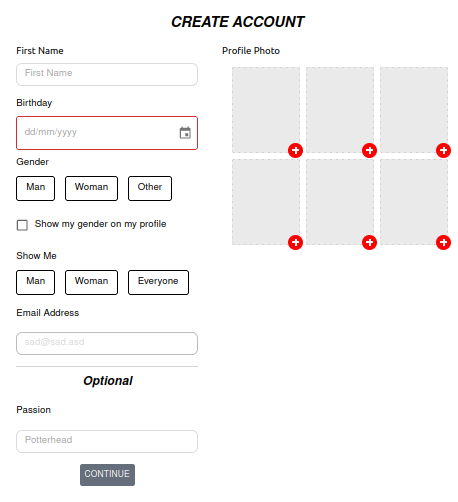
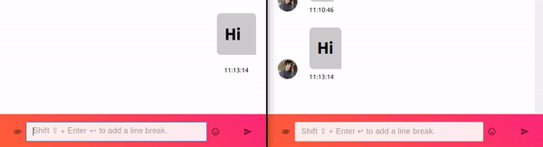
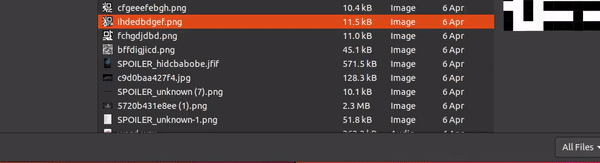
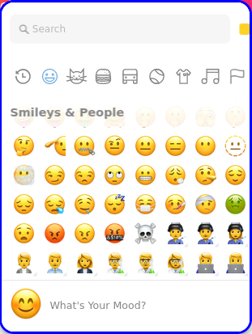
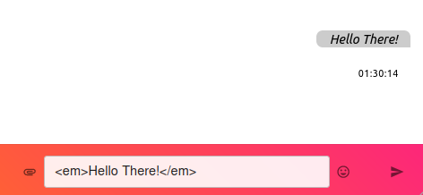
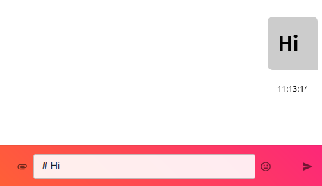

# Brave Date

<div align="center">


[](https://app.netlify.com/sites/brave-date/deploys)
[](https://brave-date.netlify.app/)
[](https://github.com/brave-date/brave-date/releases/tag/v0.2.0)
[](https://brave-date.github.io/brave-date/)

</div>

<div align="center">

<!-- ALL-CONTRIBUTORS-BADGE:START - Do not remove or modify this section -->
[](#contributors-)
<!-- ALL-CONTRIBUTORS-BADGE:END -->

</div>


## Table of Contents

- [Introduction](#introduction)
- [Supported Features](#supported-features)
- [Core Libraries](#core-libraries)
- [Running locally with NPM](#running-locally-with-npm)
- [Deployment](#deployment)
- [Documentation](#documentation)
- [License](#license)
- [Contributors](#contributors)

## Introduction

**Brave Date** is a **fully featured** Tinder clone developed using open source tools from scratch. It's designed to become the ultimate Tinder clone. It is **user-friendly** with a clean interface that is easy to navigate.

As well as being **feature-rich**, **Brave Date** is also **fully responsive**, meaning it will work seamlessly on a wide range of devices. So whether you're dating on your desktop or your mobile, you'll always have a great experience.

## Supported Features

* Landing Page.
    


* OnBoarding Page.
    

    
* Tinder Cards.
    


* Keyboard shortcuts.
    

    
* Sending and receiving text messages in real time.
    

    
* Sending and receiving images in real time.
    


* Emojies support.
    

 
* The ability to render HTML tags, links, emails, etc.
    


* The ability to render markdown text.
    


## Core Libraries

\- Create React App

\- React

\- React Router 6

\- Material UI

\- Redux

## Running locally with NPM

- Fork/Clone the repo:

```sh
git clone git@github.com:brave-date/brave-date.git
```

- Open the newly created directory:

```sh
cd brave-date
npm install
```

In order to run the project locally or build for production use, you will need to set the following environment variables to connect with the server: 

```sh
export REACT_APP_SERVER_URL=http://localhost:8000/api/v1
export REACT_APP_SOCKET_URL=ws://localhost:8000/api/v1/ws
```

Now, you can run the client:

```sh
npm start
```

Navigate to [http://localhost:3000](http://localhost:3000) to explore the landing page.

## Deployment

To deploy the client, you will need to set the following environment variables that help the client connect to the server.

```sh
* REACT_APP_SERVER_URL - Your deployed server APIs url.
* REACT_APP_SOCKET_URL - Your deployed server Sockets url.
```

### Deploy to a Static Hosting Provider

[](https://heroku.com/deploy?template=https://github.com/brave-date/brave-date)

[](https://app.netlify.com/start/deploy?repository=https://github.com/brave-date/brave-date)

### Deploy locally with Compose v2

Navigate to [the server repository](https://github.com/brave-date/brave-date-server) and follow the instructions listed in [this section](https://github.com/brave-date/brave-date-server#deploy-locally-with-compose-v2) to run both the client and the server in docker containers.

## Documentation

You can refer to [the official documentation](https://brave-date.github.io/brave-date) for additional guides, examples, and APIs.

## License

This project and the accompanying materials are made available under the terms and conditions of the [`MIT LICENSE`](https://github.com/brave-date/brave-date/blob/main/LICENSE).

## Contributors

<!-- ALL-CONTRIBUTORS-LIST:START - Do not remove or modify this section -->
<!-- prettier-ignore-start -->
<!-- markdownlint-disable -->
<table>
  <tbody>
    <tr>
      <td align="center"><a href="https://github.com/wiseaidev"><br /><sub><b>Mahmoud Harmouch</b></sub></a><br /><a href="#maintenance-wiseaidev" title="Maintenance">🚧</a></td>
    </tr>
  </tbody>
</table>

<!-- markdownlint-restore -->
<!-- prettier-ignore-end -->

<!-- ALL-CONTRIBUTORS-LIST:END -->